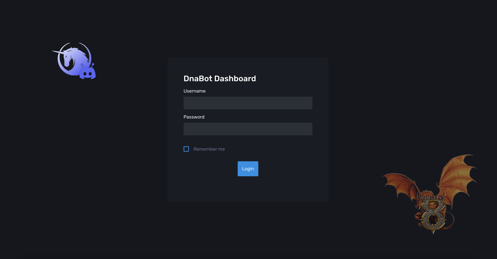
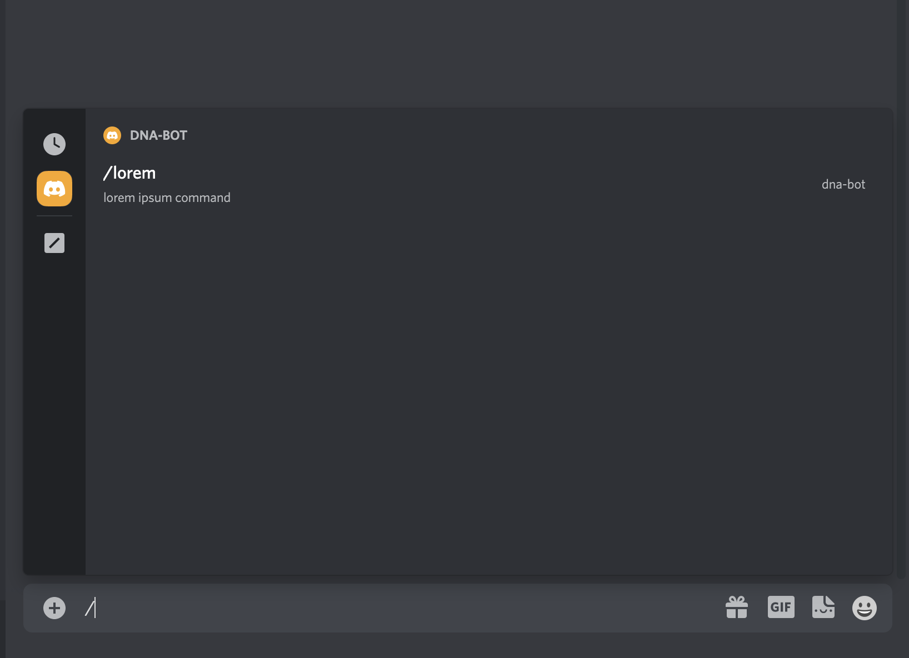

<a name="readme-top"></a>


<!-- PROJECT LOGO -->
<br />
<div align="center">
  <a href="https://github.com/alessiospina/DNA-Discord-Bot">
    
  </a>

  <h3 align="center">Dna Bot Dashboard</h3>

  <p align="center">
    Discord Bot designed for Dawn of new Age (Unofficial Ultima Online Shard)
    <br />
    <a href="https://github.com/alessiospina/DNA-Discord-Bot"><strong>Explore the docs »</strong></a>
    <br />
    <br />
  </p>
</div>


<!-- TABLE OF CONTENTS -->
<details>
  <summary>Table of Contents</summary>
  <ol>
    <li>
      <a href="#about-the-project">About The Project</a>
      <ul>
        <li><a href="#built-with">Built With</a></li>
      </ul>
    </li>
    <li>
      <a href="#getting-started">Getting Started</a>
      <ul>
        <li><a href="#prerequisites">Prerequisites</a></li>
        <li><a href="#installation">Installation</a></li>
      </ul>
    </li>
    <li><a href="#usage">Usage</a></li>
    <li><a href="#license">License</a></li>
    <li><a href="#contact">Contact</a></li>
    <li><a href="#acknowledgments">Acknowledgments</a></li>
  </ol>
</details>


<!-- ABOUT THE PROJECT -->
## About The Project
*Dna Bot Dashboard* is a project developed with the intention of improving my skills by learning **NestJS** and the **discord.js** package.

The project consists of the analysis, development and testing of a web application that allows one to be able to effectively manage a discord bot.

The application consists of a **discord bot** and a **web client** that through authentication allows the user to be able to add, delete, and edit commands for the bot to handle.

<p align="right">(<a href="#readme-top">back to top</a>)</p>

### Built With

* [NestJS](https://nestjs.com/)
* [discord.js](https://discord.js.org/#/)
* [Corona Admin](https://github.com/BootstrapDash/corona-free-dark-bootstrap-admin-template)
* [Bootstrap 4](https://getbootstrap.com/docs/4.6/getting-started/introduction/)
* [JQuery](https://jquery.com/)
* [CSS]()

<p align="right">(<a href="#readme-top">back to top</a>)</p>


<!-- GETTING STARTED -->
## Getting Started

### Prerequisites
* npm
  ```sh
  npm install npm@latest -g
  ```

### Installation

1. Clone the repo
   ```sh
   git clone https://github.com/alessiospina/DNA-Discord-Bot.git
   ```
2. Install NPM packages
   ```sh
   npm install
   ```
3. Create a bot on [Discord Developer Portal](https://discord.com/developers/docs)

4. Create .env file following the schema in `.public.env`
   ```js
   DISCORD_TOKEN = ** Discord token **
   DISCORD_APPLICATION_ID = ** Discord application id **
   JWT_SECRET = ** alfanumeric string **
   JWT_EXPIRES_IN = ** example: '3600s'**
   SESSION_SECRET = ** alfanumeric string **
   DATABASE_PORT = ** db port **
   DATABASE_HOST = ** db host **
   DATABASE_USERNAME = ** db user **
   DATABASE_PASSWORD = ** db pass **
   DATABASE_SCHEMA = ** db schema **
   ADMIN_USERNAME = ** user **
   ADMIN_PASSWORD = ** pass **
   ```
5. Run with: 
   ```sh
   npm run start:dev
   ```

<p align="right">(<a href="#readme-top">back to top</a>)</p>


<!-- USAGE EXAMPLES -->
## Usage


### Login 

* Visit url: `/`
  
 

* Insert `username` and `pass`, uses values set in the `.env` file `(ADMIN_USERNAME, ADMIN_PASSWORD)`.

<p align="right">(<a href="#readme-top">back to top</a>)</p>

### Create Command 

* Visit url: `/dashboard`
  
[](content/video/add-lorem-command.mov)

* Press the **Add** button;

 

* Fill in fields: `action`, `description`, `response`

 

* Press **Confirm**

 

* Command **lorem** added!
<p align="right">(<a href="#readme-top">back to top</a>)</p>

### Execute Command

* Go to the environment where your bot operates. In my case it is a channel created to test its use;

 

* Type / to see all the commands that can be operated by the bot, in our case we will see that there is the command /lorem

 

* Click on `/lorem` command and press enter

 

* As you can see, the command was executed returning the previously set response


<!-- CONTRIBUTING -->
## Contributing

Contributions are what make the open source community such an amazing place to learn, inspire, and create. Any contributions you make are **greatly appreciated**.

If you have a suggestion that would make this better, please fork the repo and create a pull request. You can also simply open an issue with the tag "enhancement".
Don't forget to give the project a star! Thanks again!

1. Fork the Project
2. Create your Feature Branch (`git checkout -b feature/AmazingFeature`)
3. Commit your Changes (`git commit -m 'Add some AmazingFeature'`)
4. Push to the Branch (`git push origin feature/AmazingFeature`)
5. Open a Pull Request

<p align="right">(<a href="#readme-top">back to top</a>)</p>


<!-- LICENSE -->
## License

Distributed under the MIT License. See `LICENSE.txt` for more information.

<p align="right">(<a href="#readme-top">back to top</a>)</p>


<!-- CONTACT -->
## Contact

Alessio Spina - [Linkedin](https://www.linkedin.com/in/alessiospina93/) - alessiospina.dev@gmail.com

Project Link: [https://github.com/alessiospina/DNA-Discord-Bot](https://github.com/alessiospina/DNA-Discord-Bot)

<p align="right">(<a href="#readme-top">back to top</a>)</p>


